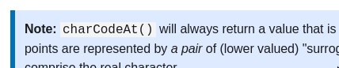

# Глосарій

Для певного спрощення роботи, і кращої консистентності термінології в текстах, ми підтримуємо централізований список термінів і прийнятих варіантів перекладу.

## Терміни

[A](#a) [B](#b) [C](#c) [D](#d) [E](#e) [F](#f) [G](#g) [H](#h) [I](#i) [J](#j) [K](#k) [L](#l) [M](#m) [N](#n) [O](#o) [P](#p) [Q](#q) [R](#r) [S](#s) [T](#t) [U](#u) [V](#v) [W](#w) [X](#x) [Y](#y) [Z](#z)

### A
#### Application
Застосунок
#### Assignment (operator)
Присвоєння (оператор)
#### At-rule
Директива
### B

#### Back-end
Бекенд (іноді серверна частина)

#### Basic Multilingual Plane (BMP)
Базовий багатомовний план (ББП)
#### Border
Межа, межі
### Box
Блок, Рамки (елемента)

Залежно від контексту може перекладатися так:

- **box model** — блокова модель
- **display box** — візуальні рамки (елемента)
- **containing box** — контейнерний блок
- **box shadow** — тінь блока
- **content box** — рамки вмісту
- **border-box** — рамки меж
### C
#### Chaining
Зв'язування (у послідовність), пов'язані
#### Collapse
Перекриватись
#### Containing block
Контейнерний блок
#### Custom
* Користувацький
* Кастомний
### D
#### Debugging
Зневадження
#### Default (i.e by default)
Усталені, як усталено
#### Define
Оголосити
#### Definition
Визначення
#### Deprecated
Нерекомендований
<!-- ### E -->
### F
#### Fallback
* Запасний варіант
* Запасний
#### Flag
Прапорець (булева змінна, яка зазвичай відповідає за збереження простого стану, як-от "увімкнено-вимкнено")
#### Flattening
Сплощення (результат виклику `Array.flat()` над масивом)
#### Flow
* Потік
* Плин
#### Font family
Сімейство шрифту
#### Front-end
фронтенд (іноді клієнтська частина)
#### Fullstack
Повностекові, повного стеку
### G
#### Gap
- Горизонтальний розрив (в контексті флексбоксів та сіток в CSS)
#### Glyph
Гліф

#### Guide
Настанови
#### Gutter
- Вертикальний розрив (в контексті флексбоксів та сіток в CSS)

<!-- ### E
### H -->
### I
#### Inline
* Вбудований
* Рядковий
#### Invalid
* Недійсний
* Неправильний
* Некоректний
#### Iterable
Ітерований (об'єкт)
<!-- ### J
### K -->
### L
#### Label
* Мітка (мітка ділянки програмного коду)
* Етикетка (етикетка поля форми)
#### Layout
* Верстка
* Верстання
* Розкладка
* Компонування
#### Layout model
Модель компонування
#### Legacy
Застарілий
### M
#### Management (i.e memory management)
Керування (керування пам'яттю)
#### Mashup
Мешап
### N
#### Note
Примітка (зокрема назва блакитного блока з примітками):

### O
#### Obsolete
Невживаний
#### Override
* Заміщати (зокрема в контексті ООП)
* Зневажати
#### Outline
Обриси
### P
#### Progressbar
Індикатор виконання
#### Promise
Проміс
<!-- ### Q -->
### R
### Realm
Область
#### Reference
Довідка (в сенсі reference doc), або посилання (в сенсі by reference)
### Render
* Рендер
* Візуалізувати
* Наносити
### Replaced element
Заміщений елемент
### Return value
Повернене значення
### S
#### Snapshot
* Знімок
* Зліпок
#### Sprite
Спрайт
#### Stacking
Нагромадження
#### Stacking context
Контекст нагромадження
#### Statement
* Інструкція
* Виказ
#### Superclass
Надклас
### T
#### Tag
Тег
#### Tutorial
Настанови
#### Typeface
Гарнітура
### U
#### User agent
Користувацький агент
### V
#### Valid
* Чинний
* Дійсний
* Валідний
#### Viewport
Вікно перегляду
### W
#### Web application
Вебзастосунок
#### Website
Вебсайт
#### Writing mode
Режим письма
<!-- ### X
### Y
### Z -->
## Корисні посилання

[Приклад](https://github.com/IhorHordiichuk/Dictionary) 

[Глосарій документації Kubernetes українською](https://kubernetes.io/uk/docs/contribute/localization_uk/)

[Глосарій документації React українською](https://uk.reactjs.org/docs/glossary.html)