# Як перекладати в середовищі GitHub

Оскільки не всім зручно працювати у середовищі командного рядка, ми підготували алгоритм, як можна виконати повний цикл перекладу цілком в середовищі GitHub, без необхідності клонувати репозиторій і встановлювати текстовий редактор.

## Перед початком роботи

- Вам знадобиться обліковий запис на [github.com](https://github.com/).
- Також вам знадобиться зробити [форк](https://docs.github.com/en/get-started/quickstart/fork-a-repo) [цього репозиторію](https://github.com/webdoky/content), в якому і буде відбуватись робота.

## Допоміжні матеріали для перекладу

Дуже важливо зберігати структуру статей в репозиторії, оскільки від цього залежить коректність роботи навігації на вебсайті (і, відповідно, доступність цих текстів для користувачів). Для того, щоб трохи спростити найбільш кропітку і рутинну частину цієї роботи, ми створили сторінку [статусу перекладу](https://webdoky.org/translation-status-priority), куди додали іще й такі корисні посилання:

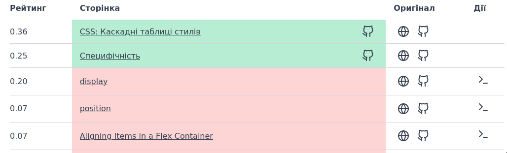

В таблиці зі статусом є колонка під назвою "Оригінал", вона містить посилання на оригінальну статтю на [MDN](https://developer.mozilla.org/), а також посилання на сирцевий текст тієї статті в [репозиторії MDN](https://github.com/mdn/content). З ними ми й будемо працювати.

## Алгоритм додавання нового перекладу в репозиторій

Припустимо, ми збираємося перекласти статтю про CSS-властивість `position`. Ось вона в таблиці:
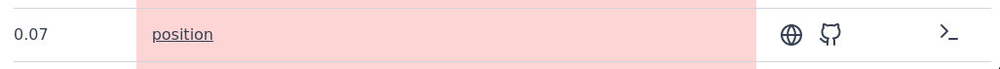
Іконка логотипу GitHub веде на сирці тексту цієї статті, відкриємо її в окремій вкладці, вона нам знадобиться.

Наступний крок — нам необхідно створити новий файл у нашому репозиторії, так, щоб він знаходився на тому самому місці, що й оригінальний текст в [репозиторії MDN](https://github.com/mdn/content). Відкритий оригінал нам має показати отакий шлях — це те, що нам потрібно відтворити в нашому репозиторії:

Скопіюємо ту частину, яка знаходиться після `...en-us/web/`.

> Взагалі цей шлях складається з трьох таких частин:
> 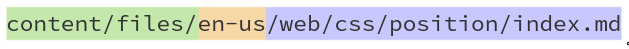
> - Перша — просто шлях до статей в репозиторії. Він може бути будь-яким (в нашому репозиторії це просто `files`).
> - Друга — це локаль, код мови в нижньому регістрі. В оригінальному репозиторії це `en-us`, в нашому, відповідно, `uk`.
> - А третя — це саме той шлях, який і відповідає за структуру навігації, і який нам так важливо відтворити

Отже, ми скопіювали корисну для нас частину шляху, тепер створимо сам файл. Для цього відкриємо наш форк, і перейдемо всередину `files/uk/web` — де і знаходяться наші розділи з текстами.
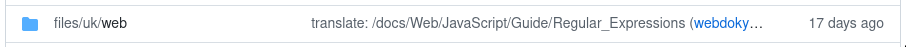

Відповідно, навігація має показати нам ось таку картину.
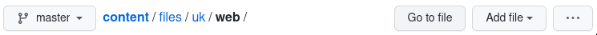
> Оскільки тут ми вже знаходимося всередині теки `.../web/`, нам з оригінального шляху потрібно скопіювати лише те, що знаходиться **_після_** неї

Додаємо файл. Для цього з правого краю в навігаційному рядку є кнопка "Add file". Нам потрібен пункт "Create new file".
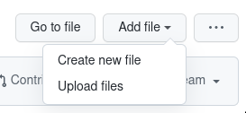

Гітхаб перенесе нас на нову сторінку, і запропонує отут ввести назву файлу.

Скористаємося цим, щоб ввести також і шлях — вставимо туди ту частину шляху, яку ми раніше скопіювали з оригінального файлу. У нас має вийти щось таке

> Імена файлів також повинні цілком збігатися з оригінальними, особливо розширення `.md`

## Перенесення і переклад вмісту файлу

Отже, файл у нас створений, лежить там, де потрібно, тепер треба обробити його вміст. Для цього повернемося на вкладку з оригінальним текстом
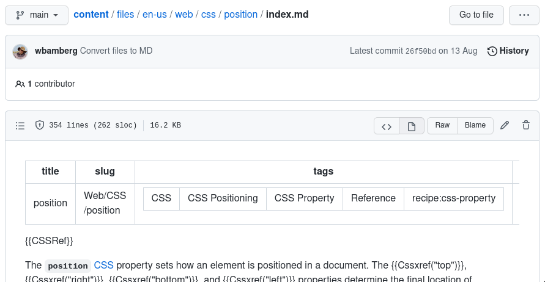
Тепер на ній нас цікавить сам файл. Проте зараз ми його вміст використати не можемо, оскільки GitHub розпізнає текст у форматі Markdown, і на льоту перетворює його в документ. Нам для сирців потрібний саме первісний код цієї статті. Вгорі блоку з файлом є заголовок, де окрім загальних даних і різних кнопок міститься також потрібна нам клавіша `Raw`.

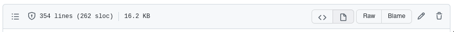

Браузер перенесе нас на оцю сторінку з саме тим текстом, який нам потрібен.
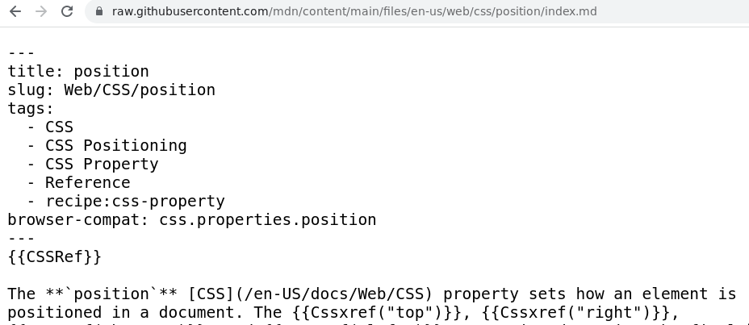
Скопіюємо його, повернімося до нашого новоствореного файлу, і вставимо його туди:

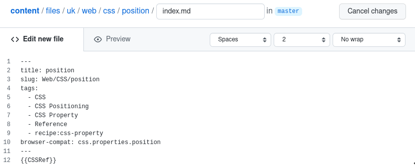

Тепер цей файл можна перекладати на місці. Або ж перенести в інший зручний для вас текстовий редактор, і перекласти там. Потім треба буде лише скопіювати його назад.

## Збереження файлу

Після того, як ми створили файл і переклали його, треба це все іще зберегти всередині репозиторію. Для цього прокрутимо сторінку донизу, там знаходиться форма, яку нам необхідно заповнити.
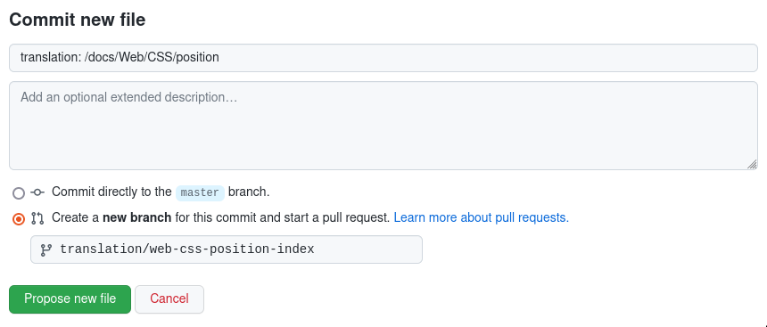

В назві повинно бути коротке повідомлення, яке однозначно описує зроблену нами зміну. Як оформити назву - дивіться [тут](/docs/git-naming-conventions). Розширений опис нам тут не потрібен, це поле можна пропустити

Далі, потрібно перемкнути радіоперемикач внизу з "Commit directly to..." у " Create a new branch". Можна працювати з головною гілкою напряму, але тоді кожна нова перекладена стаття буде підтягуватись у той самий пуллреквест, ускладнюючи процес ревю. Оформлення гілки також описано [тут](/docs/git-naming-conventions)

Після збереження коміту можна робити пуллреквест в основний репозиторій.