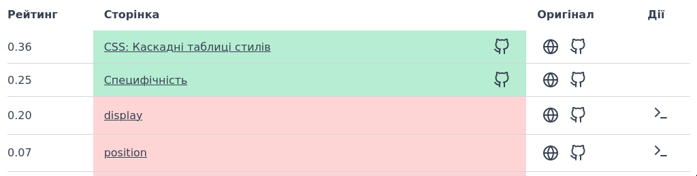

# Як відбувається переклад

> Ми підготували перелік нескладних завдань, з яких можна почати роботу, одночасно ознайомлюючись із проєктом. Знайти їх можна за оцим [посиланням](https://github.com/webdoky/content/issues?q=is%3Aissue+is%3Aopen+label%3A%22good+first+issue%22)

> **На цій сторінці знаходиться опис роботи з репозиторієм з позиції людини, яка достатньо комфортно себе почуває з git та інтерфейсом командного рядка. Якщо вам більш комфортно працювати в графічному середовищі — ось тут є [алгоритм перекладу в середовищі GitHub](/docs/translating-in-github)**

## Підготовка робочого оточення

Для початку вам знадобиться:

1. `git` для роботи з репозиторіями
2. Програми, яких вимагає оцей [репозиторій](https://github.com/webdoky/content)
3. Текстовий редактор, з яким вам зручно працювати

Далі почнімо роботу з репозиторієм.

1. [Форкніть](https://docs.github.com/en/get-started/quickstart/fork-a-repo) репозиторій, щоб ви мали свою окрему копію, і мінімально перетинались з іншими учасниками.

2. Клонуйте ваш форк на локальний комп'ютер. Зазвичай це робиться командою
```
git clone git@github.com:%ваш_акаунт%/content.git webdoky-content
```
Ця команда створить новий репозиторій в каталозі `webdoky-content` і завантажить туди вміст нашого репозиторію з текстами.

> Робота через форк дозволяє працювати без жодних обмежень чи регламентів щодо організації чи іменування гілок, можна працювати навіть напряму з основної. Разом з тим, ми рекомендуємо кожну окрему статтю оформлювати як окрему гілку, оскільки приймання пуллреквест в основний репозиторій може зайняти якийсь час. Наші рекомендації щодо оформлення гілок доступні [тут](/docs/git-naming-conventions).

## Переклад

> **Перед початком:** слід розуміти, що файлова структура репозиторію з текстами повністю відповідає структурі навігації. Наприклад, текст статті, яка доступна за посиланням `/uk/docs/Web/JavaScript/Reference/Global_Objects/Array`, буде знаходитись тут [https://github.com/webdoky/content/blob/master/files/uk/web/javascript/reference/global_objects/array/index.md](https://github.com/webdoky/content/blob/master/files/uk/web/javascript/reference/global_objects/array/index.md). Це, своєю чергою, повністю відповідає структурі репозиторію MDN, тобто оригінал статті знаходиться тут [https://github.com/mdn/content/blob/main/files/en-us/web/javascript/reference/global_objects/array/index.md](https://github.com/mdn/content/blob/main/files/en-us/web/javascript/reference/global_objects/array/index.md)

1. Виберіть текст, який ви хочете перекласти. Для цього ми створили сторінку з актуальними статусами перекладу [статусу перекладу](https://webdoky.org/translation-status-priority).

Якщо це новий переклад, в таблиці навпроти назви буде іконка терміналу в стовпчику "Дії".

Вона скопіює в буфер обміну баш-скрипт, який, якщо його виконати в корені репозиторію, створить необхідне дерево каталогів для обраної статті, і завантажить в нього свіжу версію файлу з репозиторію MDN.

> Цей скрипт адаптовано під ОС Linux стандартної комплектації. Якщо у вас інша операційна система — ймовірно вам знадобиться доповнити чи переробити цей скрипт.

> Також цю процедуру можна виконати самостійно, скопіювавши відповідний файл з [репозиторію MDN](https://github.com/mdn/content/) у клонований репозиторій. Будьте уважні, імена файлів і шлях (той, що знаходиться після `/en-us/`) повинні збігатися.

2. Відкрийте цей файл у текстовому редакторі. Шапку з Front Matter перекладати не потрібно, окрім заголовка. В більшості статей довідника заголовок перекладати також не потрібно. Щодо тексту:

	- Текст статті перекладається цілком
	- З коду перекладаються коментарі (назви змінних чи функцій перекладати не потрібно)
	- Під час перекладу посилань слід враховувати, що локаль `en-US` в тілі посилання також міняється на `uk`

> **Зауваження:** в тілі статті будуть траплятися вставки коду, як от `{{jsxref("Array.prototype.concat()")}}`. Це вказівник на вміст, який буде вставлено в це місце статті на етапі збирання проєкту, окремі частини яких також потрібно перекладати. В разі виникнення запитань зверніться до нашого робочого чату.

## Фіналізація

1. Після завершення перекладу, запустіть необхідні перевірки тексту через languageTool, так, як це описано в [https://github.com/webdoky/content](https://github.com/webdoky/content).

2. Збережіть цей шмат роботи в репозиторії.
```
git commit
```
Для оформлення комітів ми використовуємо схему Conventional commits, ознайомитися з ними можна [тут](/docs/git-naming-conventions).

3. Надішліть цей коміт до вашого форку, і створіть пуллреквест


## Корисні посилання
 - [Правила зміни у - в та і - й](https://zbruc.eu/node/41947)
 - [Статус перекладу документації загалом](/translation-status-general)
 - [Статус перекладу (приоритетні сторінки)](/translation-status-priority)